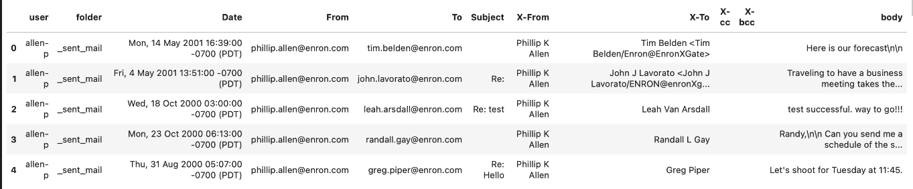

## 1. Introduction
### 1.1. The Situation
Responding to emails can be an endless task - in the time it takes you to read, process and action one email, another 5 have landed in your inbox. 

Of course, some emails are more important than others, and it would be helpful if such emails were flagged appropriately so that they can be dealt with as a matter of priority.

For many corporate email users, one such class of "urgent" emails are those that are chasing the user to provide missing documents or missing payments. For example:

    I have not received your dues yet.  I am giving you a one week reprieve.  If 
    I do not receive your dues ($110) by this Sunday, you will forfeit.  

    My address is:
    
    2302 Travis St.. #8225
    Houston  77006

    -Eric

These are potentially business-critical tasks for the user, and as such an automated system to identify them would be valuable.

You are part of a project to develop such a system using a machine learning approach.

### 1.2. The Data
For initial exploration, we have a large set of publicly-available email data from a large corporation, Enron. There are around ~56k emails in this dataset from the email accounts of ~150 senior executives. The data is not labelled.

They are stored in a simple .csv file, as shown below:

The main text of each email is stored in the column `body`.

### 1.3. The Task
We would like you to consider how you would develop a solution to the situation described above. 

We don't expect you to build a model to carry out this classification, just to explore the data and demonstrate some of the key ideas/techniques that you would hope to use in addressing it. In particular, we would like you to:

1. Explore the data:
    - write a function, taking the text data as an input, to prepare/clean the data 
    - find examples of emails that relate to missing documents/payments
    - identify distinguishing characteristics of these emails
    
2. Demonstrate key ideas/techniques:
    - represent the email data numerically with one method (NLP or other) of your choice
    - explain the method you chose and any parameters involved
    - explain how this method does (or does not) capture the "distinguishing characteristics" of missing document/payment emails
    - be prepared to discuss other methodologies you could use and why they might be more/less useful 
    - explain how you would use your numerical representation to build a classification model
    
3. If you were to continue this project:
    - what approaches would you look to explore further?
    - do you forsee any particular challenges in this task?

You should be ready to present and explain your work at the end of the task. We would like to see at least one visualisation/plot to explain some of your analysis. You don't need to produce a PowerPoint, though - we'd rather you spent the majority of your time developing interesting ideas about the data, and just make sure that you're able to communicate your ideas to us clearly at the end.
